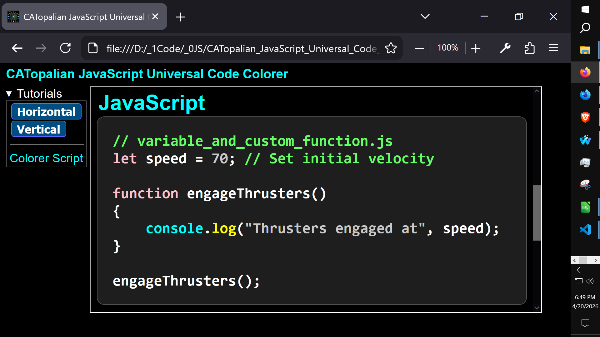
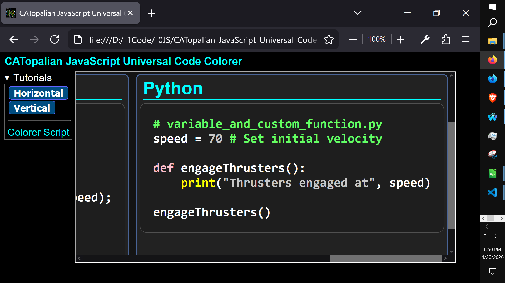

# CATopalian JavaScript Universal Code Colorer
Colors All Languages Code! Just specify which language and add whatever keywords you like to the array.

---

## Import the Colorer Script
```html
<script src = '../js/color/catopalian_javascript_universal_code_colorer.js'></script>
```

---

## Body Section
We add this to the body tag
```html
<body onload = 'applyCustomHighlighting();'>
```
---

## Code Section
We then just add a code tag 
```html
<h3> JavaScript </h3>
<code class="custom-code" data-language="js">let speed = 70; // Set initial velocity

function engageThrusters()
{
    console.log("Thrusters engaged at", speed);
}

engageThrusters();</code>
```

---

<details>
<summary>  Full HTML Example </summary>

# Full HTML Example

```html
<!DOCTYPE html>
<html lang = 'en'>
<head>
<title> CATopalian JavaScript Univeral Code Translator Vertical </title>

<style>

body
{
    background-color: rgb(0, 0, 0);
    font-family: Arial;
    font-size: 24px;
    color: rgb(255, 255, 255);
}

h1, h2, h3, h4, h5, h6
{
    margin: 2px;
}

code
{
    font-family: Arial;
    font-size: 24px;
    font-weight: bold;
}

</style>

<script src = '../js/color/catopalian_javascript_universal_code_colorer.js'></script>

</head>

<body onload = 'applyCustomHighlighting();'>

<h3> SLua </h3>
<code class="custom-code" data-language="lua">local speed = 70 -- Set initial velocity

local function engageThrusters()
    print("Thrusters engaged at " .. speed)
end

engageThrusters()</code>

<hr>

<h3> JavaScript </h3>
<code class="custom-code" data-language="js">let speed = 70; // Set initial velocity

function engageThrusters()
{
    console.log("Thrusters engaged at", speed);
}

engageThrusters();</code>

<hr>

<h3> Python </h3>
<code class="custom-code" data-language="py">speed = 70 # Set initial velocity

def engageThrusters():
    print("Thrusters engaged at", speed)

engageThrusters()</code>

<hr>

</body>

</html>
```

</details>

---

## How to Use the Colorer JS File
In the **src** > **js** > **color** folder we find the Colorer Script named [**catopalian_javascript_universal_code_colorer.js**](src/js/colorer/catopalian_javascript_universal_code_colorer.js)

<details>
<summary> note </summary>
This file named catopalian_javascript_universal_code_colorer.js must be in your project folder to color the code.

Remember to applyCustomHighlighting() in the body onload of your html file.

Remember to use code tags and specify which language you want to use and put your code in between those code tags and it will be now be colored. </details>

---

Video: https://www.youtube.com/watch?v=tswEICyl8rs





---

### How to Download this App
1. Click the green Code Button on this github page
2. Choose Download ZIP
3. Save the Zip File
4. Extract All
5. Double click the HTML file to start the App

---

Happy Scripting :-)

//----//

// Dedicated to God the Father  
// All Rights Reserved Christopher Andrew Topalian Copyright 2000-2026  
// https://github.com/ChristopherTopalian  
// https://github.com/ChristopherAndrewTopalian  
// https://sites.google.com/view/CollegeOfScripting  
College of Scripting Music & Science

